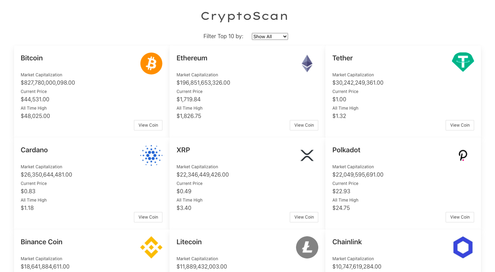
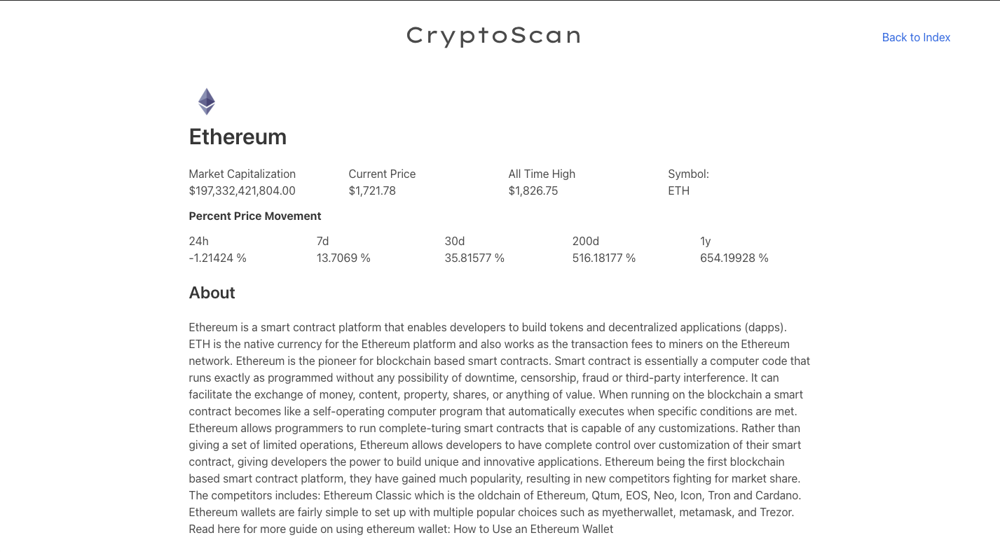

# React CryptoScan

> A React-Redux application that provides Crypto Coin Statistics and Information.

## Screenshots

## Video Presentation Links

[Part 1](https://www.loom.com/share/bcefbf0fe1cb4ba396e3afc190b6e244)
[Part 2](https://www.loom.com/share/d7a6b699955943d0a8aa46935bbde649)

## Live Link

[Open Live](https://crypto-react-scanr.herokuapp.com/)

## Built With

- React
- Redux
- Bulma

## Getting Started

To get a local copy up and running follow these simple example steps.

### Setup

1.  Clone this repository with
    `git clone https://github.com/m15e/react-crypto-filter.git` using your terminal or command line.
2.  Change to the project directory by entering `cd react-crypto-filter` in the terminal
3.  Next open run `npm i` to install necessary packages and dependencies.
4.  Once the installation is complete run `npm start` to start the application.

## Authors

👤 **Mark Rode**

- Github: [@m15e](https://github.com/m15e)

## Show your support

Give a ⭐️ if you like this project!

## Acknowledgments

- Microverse

## 📝 License

This project is [MIT](lic.url) licensed.
